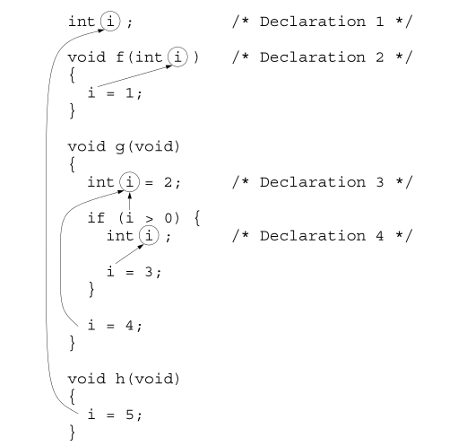

# Chapter 10 - Program Organization


## 10.1 Local Variables
- Local Variable: A variable that is declared in the body of a function.
    ```c
            int sum_digits(int n)
            {
                int sum = 0;        /* local variable */

                while (n > 0)
                {
                    sum += n % 10;
                    n /= 10;
                }

                return sum;
            }
    ```

- Automatic Storage Duration: The storage duration of a variable is the portion of program execution during which storage for the variable exists. Storage for a local variable is "automatically" allocated when the enclosing function is called and de-allocated when the function returns, so the variable is said to have **automatic storage duration**.
    - Local variables do not retain their value wnen its enclosing function returns.
    - Parameters have the same properties as local variables.
        - Initialized automatically when a function is called.

- Block Scope: The scope of a variable is the portion of the program text in which the variable can be referenced. A local variable has **block scope**: it is visible from its point of declaration to the end of the enclosing function body.
    - Since the scope of a local variable doesn't extend beyond the function to which it belongs, other functions can use the same name for other purposes.

- Static Local variables: Putting the word **static** in the declaration of a local variable causes it to have **static storage duration** instead of automatic storage duration.
    - **Static Storage Duration**: Has a permanent storage location, so it retains its value throughout the execution of the program.
        ```c
                void f(void)
                {
                    static int i;       /* static local variable */
                    ...
                }
        ```

        Since the local variable *i* has been declared *static*, it occupies the same memory location throughout the execution of the program. When *f* returns, *i* won't lose its value.
        
        A static local variable still has block scope, so it's not visible to other functions. In a nutshell, a static variable is a place to hide data from other functions but retain it for future calls on the same function.             

## 10.2 External Variables
- Variables that are declared outside the body of any function.
    - Sometimes called `global` variables.
    - **Static Storage Duration**: External variables have Static Storage Duration just like local variables that have been declared `static`. A value stored in an external variable will stay there indefinitely.
    - **File Scope**: An external variable has file scope: it is visible from its point of declaration to the end of the enclosing file.

- Example of using external variables: A `stack` is a data structure where values can be accessed via the "top" or "end" of the stack: "pushed onto the top and "popped" from the top only.

    ```c
            #include <stdbool.h>    /* C99 only */

            #define STACK_SIZE 100

            /* external variables */
            int contents[STACK_SIZE];
            int top = 0;

            void make_empty(void)
            {
                top = 0;
            }

            bool is_empty(void)
            {
                return top == 0;
            }

            bool is_full(void)
            {
                return top == STACK_SIZE;
            }

            void push(int i)
            {
                if (is_full())
                    stack_overflow();
                else
                    contents[top++] = i;
            }

            int pop(void)
            {
                if (is_empty())
                    stack_underflow();
                else
                    return contents[--top];
            }
    ```


## 10.3 Blocks
- Compound statements that can contain declarations of variables.
    - Variables declared and initialized in the block of functions or condition logic etc. are local to that block.
        - These variables have **Automatic Storage Duration**.
        - Variables that belong to a block can be declared `static` to give it static storage duration.

        ```c
                if (i > j)
                {
                    /* swap values of i and j */
                    int temp = i;
                    i = j;
                    j = temp;
                }
        ```

## 10.4 Scope
- The ability for the programmer and compiler to determine which identifier meaning is relevant at a given point in a program.
    When a declaration inside a block names an identifier that's already visisble (because it has file scope or because it's declared in an enclosing block), the new declaration temporarily "hides" the old one, and the identifier takes on a new meaning. At the end of the block, the identifier regains its old meaning.
    
    

    - In Declaration 2, i is a parameter with block scope.
    - In Declaration 3, i is an automatic variable with block scope.
    - In Declaration 4, i is also automatic and has block scope.

        i is used five times. C’s scope rules allow us to determine the meaning of i in each case:
    - The i = 1 assignment refers to the parameter in Declaration 2, not the variable in declaration 1, since Declaration 2 hides Declaration 1.
    - The i > 0 test refers to the variable in Declaration 3, since Declaration 3 hides Declaration 1 and Declaration 2 is out of scope.
    - The i = 3 assignment refers to the variable in Declaration 4, which hides Declaration 3.
    - The i = 4 assignment refers to the variable in Declaration 3. It can’t refer to Declaration 4, which is out of scope.
    - The i = 5 assignment refers to the variable in Declaration 1.

## 10.5 Organizing a C Program

- Possible way to organize your program:
    1. `#inculde` directives
    2. `#define` directives
    3. Type definitions
    4. Declarations of external variables
    5. Prototypes for functions other than `main`
    6. Definition of `main`
    7. Definitions of other functions

