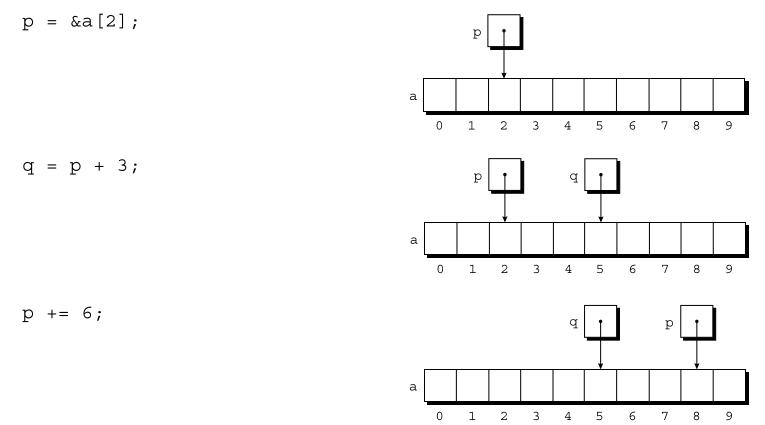
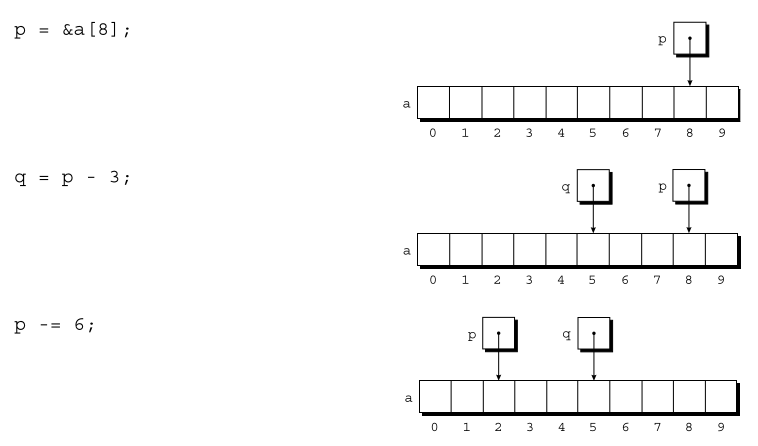
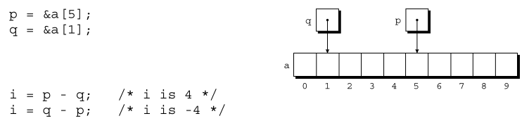
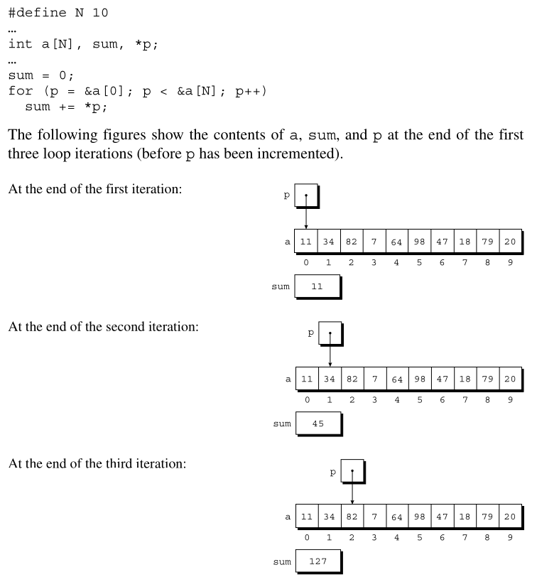
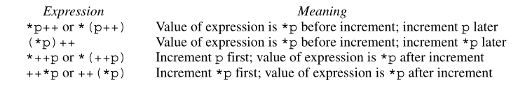

# Chapter 12 - Pointers and Arrays

## 12.1 Pointer Arithmetic
- Pointer Arithmetic (address arithmetics): Can access the other elements of and array by:
    - Adding an integer to a pointer
    - Subtracting an integer from a pointers
    - Subtracting one pointer from another

- Adding an Integer to a Pointer: Adding an integer `j` to a pointer `p` yields a pointer to the element of `j` places after the one that `p` current points to.

    

- Subtracting an Integer from a Pointer: If `p` points to the array element `a[i]`, then `p - j` points to `a[i - j]`.
    


- Subtracting One Pointer from Another: When one pointer is subtracted from another, the result is the distance (measured in array elements) between the pointers.
    - If `p` points to `a[i]` and `q` points to `a[j]`, then `p - q` is equal to `i - j`.

    

- Comparing Pointers: We can compare pointers using the relational operators `<`, `<=`, `>`, `>=` and the equality operators (`==` and `!=`).
    - Using the relational operators to compare two pointers is meaningful only when both point to elements of the same array.
    ```c
            p = &a[5];
            q = &a[1];
        
        the value of p <= q is 0 and the value of p >= q is 1.
    ```
- Pointers to Compound Literals (C99):
    ```c
            int *p = (int[]) {3, 0, 3, 4, 1};

        p points to the first element of a five-element array containing the integers
        3, 0, 3, 4, and 1. Using a compound literal saves us the trouble of first
        declaring an array variable then making p point to the first element of that
        array:

            int a[] = {3, 0, 3, 4, 1};
            int *p = &a[0];
    ```

## 12.2 Using Pointers for Array Processing



- Combining the `*` and `++` Operators: When you combine the dereference operator `*` with increment/decrement (`++` / `--`) in C (or similar languages), the key operator precedence and when the increment happens.




## 12.3 Using an Array Name as a Pointer


## 12.4 Pointers and Multidimensional Arrays


## 12.5 Pointers and Variable-Length Arrays (C99)