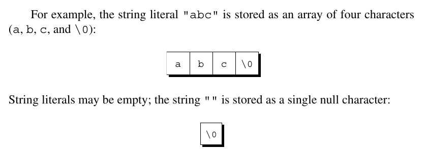
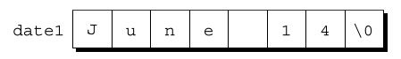
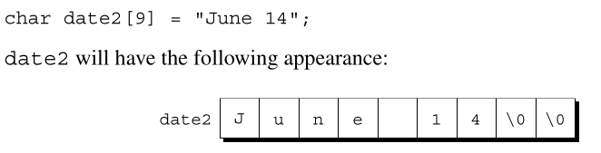
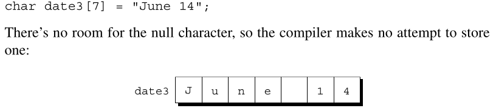

# Chapter 13 - Strings

## 13.1 String Literals
- String Literal: Sequence of characters enclosed within double quotes.
    - Cannot be modified when created.
        - Cannot index and overwrite a character.

- Escape Sequences: String literals may contain the same escape sequences as characters constants.
- Continuing a String Literal:
    - Use `\` at the end of line to carry-on a string literal.
    ```c
            printf("When you come ta a fork in the road, take it.  \
            -- Yogi Berra");
    ```
    - When two or more string lterals are adjacent (separated only by white space), the compiler will join them into a single string.
    ```c
            printf("When you come to a fork in the road, take it.  "
                    "--Yogi Berra");
    ```
- Null Character: `'\0'` that is placed at the end of string literals in memory to signigy the end of a string.
    - Size: Byte whose bits are all 0.
    - Don't confuse the null character `'\0'` with the zero character `'0'`. The null character has the code 0; the zero character has a different code (48 in ASCII).
    

## 13.2 String Variables
- Strings as Arrays
    - Define string array lengths `n + 1` to leave room for the null character at the end.
        - Because the string characters are in an array we can index and modify the characters unlike a string literal.
        ```c
                char date1[8] = "June 14";
        ```
    - The compiler will put the characters from "June 14" in the `date1` array, then add a null character so that `date1` can be used as a string.

        
    - If the string intializer is too short for the amount of memory places in the array, the compiler will fill with null characters.
        
        
    If the string initializer is too long for the amount of memory places in the array, the compiler will fill the array up to its limits, leaving off the remainder of the string, however long.
        
    - You can omit the length in the declaration and the compiler will compute the amount of memory needed automatically.
        ```c
                char date4[] = "June 14";
        ```
    - Strings as Pointers:
        ```c
                char *date = "June 14";
        ```
        - This is a string literal and we cannot modify the index components like array strings.

## 13.3 Reading and Writing Strings
- Writing Strings using `printf` and `puts`
    - `printf`
        ```c
                char str[] = "Are we having fun yet?";

                printf("%s\n", str);
            
            The output will be:
                Are we having fun yet?
        ```
        - Print only a slice: `%.ps` where `p` is the number of characters to be displayed.
            ```c
                    printf("%.6s\n", str);
                
                Will print: "Are we"
            ```
        - Print a string within a field with `%ms` where `m` is the field size. A string with more than `m` characters will be printed in full NOT truncated!

            - In C, strings can be formatted using the `%s` conversion specification in `printf()`. You can control:

            * **Field width** (minimum number of characters to occupy)
            * **Justification** (left or right alignment)
            * **Precision** (maximum number of characters to display)


            - `%ms` — Minimum Field Width: The format `%ms` displays a string in a field of width `m`.

                - ### Example

                    ```c
                    char str[] = "Programming";

                    printf("%15s\n", str);
                    ```

                    ### Output

                    ```text
                        Programming
                    ```

                    ### Explanation

                    * `"Programming"` contains 11 characters.
                    * The field width is 15.
                    * Since the string is shorter than the field width, 4 spaces are added before the string.
                    * The string is **right-justified** by default.


            - `%-ms` — Left Justification: Adding a minus sign (`-`) before the width causes the string to be left-justified.

                - ### Example

                    ```c
                    char str[] = "Programming";

                    printf("%-15s\n", str);
                    ```

                    ### Output

                    ```text
                    Programming    
                    ```

                    ### Explanation

                    * The string is printed starting at the left side of the field.
                    * Remaining spaces are added after the string.


            - String Longer Than Field Width: A field width specifies the **minimum** width, not the maximum.

                - ### Example

                    ```c
                    char str[] = "Programming";

                    printf("%5s\n", str);
                    ```

                    ### Output

                    ```text
                    Programming
                    ```

                    ### Explanation

                    * The string has 11 characters.
                    * The field width is only 5.
                    * The entire string is printed.
                    * Strings are **not truncated** when they exceed the field width.


        - `%m.ps` — Width and Precision Combined

            The format `%m.ps`:

            * Prints only the first `p` characters of the string.
            * Places the result in a field of width `m`.

            - ### Example

            ```c
            char str[] = "Programming";

            printf("%15.4s\n", str);
            ```

            ### Output

            ```text
                    Prog
            ```

            ### Explanation

            * `.4` limits output to the first 4 characters (`Prog`).
            * `15` specifies a field width of 15.
            * Since `Prog` is 4 characters long, 11 leading spaces are added.


        - `%-m.ps` — Left-Justified Width and Precision

            - ### Example

            ```c
            char str[] = "Programming";

            printf("%-15.4s\n", str);
            ```

            ### Output

            ```text
            Prog           
            ```

            ### Explanation

            * Only the first 4 characters are displayed.
            * The result occupies a field of width 15.
            * The minus sign (`-`) causes left justification.

            # Additional Examples

            ```c
            char str[] = "Computer";

            printf("|%10s|\n", str);
            printf("|%-10s|\n", str);
            printf("|%10.3s|\n", str);
            printf("|%-10.3s|\n", str);
            ```

            ### Output

            ```text
                |  Computer|
                |Computer  |
                |       Com|
                |Com       |
            ```
    - `puts`: Only has one argument, the string to be printed. After writing the string `puts` always writes an additional new-line character.
        ```c
                puts(str);
        ```

- Reading Strings using `scanf` and `gets`:
    - `scanf`:
        ```c
                scanf("%s", str);
        ```
        - Skips whitespace then reads characters and stores them in `str` until it encounters a white-space character.
        - Always stores a null character at the end of the string.
        - A string reading using `scanf` will NEVER contain whitespace.
        - New-line character will cause `scanf` to stop reading, but so will a space or a tab character.
    
    - `gets`:
        - Stores a null character at the end of a read string.
        - Does not skip white sapce before starting to read the string.
        - Reads until it finds a new-line character.
        - Discards the new-line character instead of storing it in the array, a null character takes its place.

## 13.4 Accessing the Characters in a String
- Since strings are stored as arrays, we can use subscripting to access the characters in a string.
    ```c
            int count_spaces(const char s[])
            {
                int count = 0, i;

                for (i = 0; s[i] != '\0'; i++)
                {
                    if (s[i] == ' ')
                    {
                        count++;
                    }
                }
                return count;
            }
    ```    

- More common to use a `pointer` to string start:
    ```c
            int count_spaces(const char *s)
            {
                int count = 0;

                for (; *s != '\0'; s++)
                {
                    if (*s == ' ')
                    {
                        count++;
                    }
                }
                return count;
            }
    ```


        