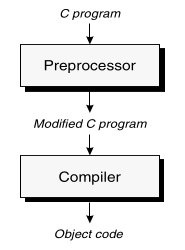
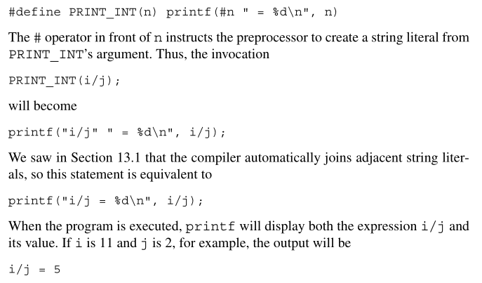
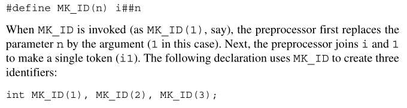
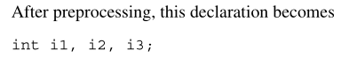
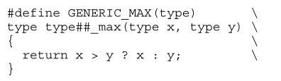
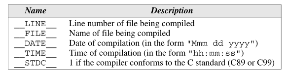
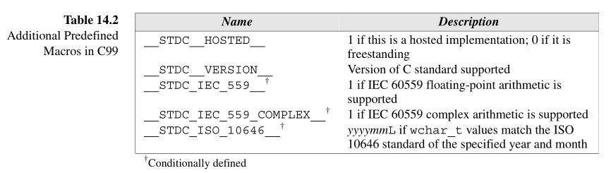
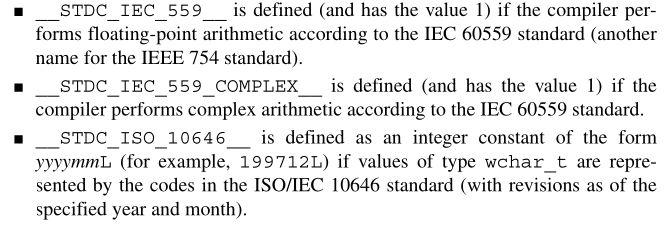

# Chapter 14 - The Preprocessor


## 14.1 - How the Preprocessor Works

- Preprocessing Directives: Commands that begin with the `#` character.

- `#define`: defines a macro (a name that represents something else). 
    - Preprocessor stores the name of the macro together with its definition.
    - When the macro is used later in the program, the preprocessor "expands" the macro, replacing it by its defined value.

        

`-E` Compiler Method (GCC): Generate preprocessor output.

## 14.2 - Preprocessing Directives

- 3 Categories (typically):
    1. Macro definitions
    2. File inclusion
    3. Conditional compilation

Rules:
1. Directive always begin with a `#``
2. Any number of spaces and horizontal tab characters may separate the tokens in a directive.
3. Directives always end at the first new-line character, unless explicitly continued with `\`.
4. Directives can appear anywhere in a program.
5. Comments may appear on the same line as a directive.


## 14.3 - Macro Defintions

- Simple macros: `#define identifier replacement-list``

- Replacement-list: Any sequence of preprocessing tokens

- Parameterized Macros: `#define identifier(x1,x2,...,xn) replacement-list`
    - No spaces inbetween the parameters
    ```c
            #define MAX(x, y)   ((x) > (y) ? (x) : (y))
            #define IS_EVEN(n)  ((n) % 2 == 0)

            int main(void)
            {
                ....
                i = MAX(j+k, m-n);
                if (IS_EVEN(i)) i++;
            }
    ```
    ```c
            i = ((j+k) > (m-n) ? (j+k) : (m-n));
            if ((i) % 2 == 0) i++;
    ```

- `#` Operator (stringization)


- `##` Operator: Can "paste" two tokens together to form a single token.




- `#undef identifier`: Removes the current definition of the identifier macro. 

- Parentheses need to wrap around all the parameters used in the replacement list.


- Predefined Macros:

    
    

- Host implemented: Must accept any program that conforms to the C99 standard. 
- Freestanding implemented: Does not have to compile programs that use complex types or standard headers beyond a few of the most basic.

    

`__func__`: Contains the name of the current function called. 

## 14.4 Conditional Compilation

## 14.5 Miscellaneous Directives
