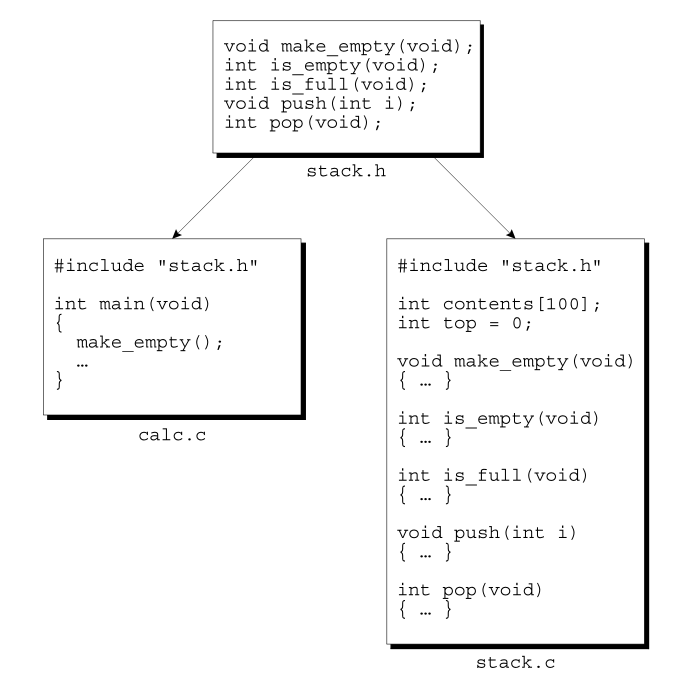

# Chapter 15 - Writing Large Programs

## 15.1 Source Files
- Source Files: Files that have the `.c` extension.
    - Each source file contains part of the program, primarily definitions of functions and variables.

- enefits of splitting into multiple files:
    - Individual compilation of files for frequent changes of separate scopes.

## 15.2 Header Files
- Header File: Files that are included via the `#include` directive.
    - End in `.h` extension.
    - Sometimes referred to as *include files*.
- `#include` Directive:
    - 2 Primary Forms and 1 less used/frequent form:
        1. `#include <filename>`: Used for header files that belong to C's own linrary.
        2. `#include "filename"`: Used for all other header files (also including one we create).
        3. `#include tokens`: The preprocessor will scan the tokens and replace any macros that it finds.
    - `-Ipath`: a command-line option used to edit the default search path for header files.

    ```c
        #include "c:\cprogs\utils.h"    /* Windows path */

        #include "/cprogs/utils.h"      /* UNIX path */
    ```
    - Note: This is not a string literal and backslashes are not escaped.

    ```c
        #if defined(IA32)
            #define CPU_FILE "ia32.h"
        #elif defined(IA64)
            #define CPU_FILE "ia64.h"
        #elif defined(AMD64)
            #define CPU_FILE "amd64.h"
        #endif

        #include CPU_FILE
    ```

    

- `extern` Variables: Variables declared with `extern` are linked to variable definitions found in header files when included. Memory is set aside for the variable once shared amongst the files where included.
    - Omit the size of an array when using `extern` variable for an array. 
    ```c
        extern int a[];
    ```

- Protecting Header Files:
```c
    #ifndef BOOLEAN_H
    #define BOOLEAN_H
    #define TRUE 1
    #define FALSE 0
    typedef int Bool;
    #endif
```


