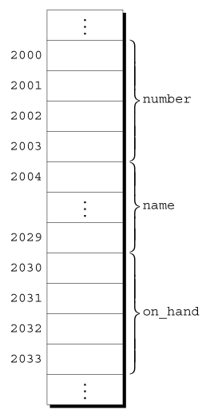

# Chapter 16 - Structures, Unions, and Enumerations

## 16.1 Structure Variables

- Structure Variables: A collection of elements or data types that do not have to be the same overall type and are grouped into a "container".
    - Members: Data objects found within structures.
    - Access members of a structure with a `.` operator.
    - Names declared in the scope of a structure are local to that structure.
    ```c
        struct
        {
            int number;
            char name[NAME_LEN + 1];
            int on_hand;
        } part1, part2;
    ```
    
    - `int` 4 byte
    - `NAME_LEN` 25 chars
- C99 Designated Initializer
    - Order doesn't matter
    - Undesignated values default to iniializer order.
        ```c
            {.number = 528, .name = "Disk drive", .on_hand = 10}
        ```
- Structure variables of the same type can be copied directly with `=`.
    - Even arrays within the structure are copied unlike arrays alone.

## 16.2 Struture Types

- Structure declarations without a *type* name cannot be reused elsewhere to create the same *type* of structure.
    - We need to provide a *type* name to the structure.
    1. Structure Tag: It is a name used to identify a particular kind of structure. 

    - Ex. Structure tag named `part`: `part` name defines the reusable `struct part` type.
        - Semicolon follows to close the definition.
        ```c
            struct part
            {
                int number;
                char name[NAME_LEN + 1];
                int on_hand;
            };
        ```
    - Use e.x. `struct part part1, part2` to define new variables where `part1` and `part2` are two variables of type `struct part`.
    
    2. Defining a Stucture Type: We can use *`typedef`* to define a genuine type name
        ```c
            typedef struct
            {
                int number;
                char name[NAME_LEN + 1];
                int on_hand;
            } Part;


            Part part1, part2;
        ```
    - `Part` is the name of the type and comes at the end.
    - Now `Part` can be used the same way other types like `int` etc. to declare variables.

- C99 Compound Literals: Creating Structures on the fly.
```c
    print_part((struct part) {528, "Disk drive", 10});
```

