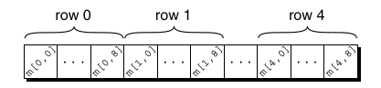

# Chapter 8 - Arrays

- Variables:
    - Scalars: Capable of holding a single data item.
    - Aggregate: Can store collection of values.

## 8.1 One-Dimensional Arrays
- Array: A data structure containing a number of data values, all of which have the same type.
    - Elements: The values within the array, and can be individually selected by their position.

- Declare an array: Specify the type and the number of the elements in the array.
    - `type array_name [#];`
- Array Subscripting/Indexing: To access a particular element of an array, we write the array name followed by an integer value in square brackets `[]` (this is referred to as **subscripting** or **indexing** the array).
    - Array elements are always numbered starting from 0, so the elements of an array of length n are `indexed from 0 to n - 1`.
    - `a[i]`: **lvalues** and these can be used like ordinary variable.
    ```c
        a[0] = 1;
        printf("%d\n", a[5]);
        ++a[i];
    ```
    - In general, if an array contains elements of type *T*, then each element of the array is treated as if it were a variable of type *T*.
    - C doesn't require that subscript bounds be checked; if a subscript goes out of range, the program's behavior is undefined.
- Array and `for` loops:
```c
    for (i = 0; i < N; i++)
        a[i] = 0;                   /* clears a */
    
    for (i = 0; i < N; i++)
        scanf("%d", &a[i]);         /* reads data into a */

    for (i = 0; i < N; i++)
        sum += a[i];                /* sums the elements of a */
```
- Array Initialization:
    - ex.
    ```c
        int a[10] = {1, 2, 3, 4, 5, 6, 7, 8, 9, 10};
    ```
    - If the initializer is shorter than the array length defined, the blanks are filled with 0.
        ```c
            int a[10] = {1, 2, 3, 4 5, 6};
            /* initial value of a is {1, 2, 3, 4, 5, 6, 0, 0, 0, 0} */
            int a[10] = {0};
            /* initial value of a is {0, 0, 0, 0, 0, 0, 0, 0, 0, 0} */
        ```
    - If an initializer is present the length of the array may be omitted.
    ```c
        int a[] = {1, 2, 3, 4, 5, 6, 7, 8, 9, 10};
    ```
- Designated Initializers (C99): Initialize specific index locations during array initialization, index locations that are not mentioned are filled by 0. Order does not matter.
    - ex.
        ```c
            int a[15] = {[2] = 29, [9] = 7, [14] = 48};
        ```

        - Each number in the brackets (not braces {}) is said to be a designator. Must be integer constant expressions between 0 and n -1, where n is the length of the array. If the size of the array is omitted, the largest designator defines the last position of the array, array length = largest designator + 1.
        ```c
            int b[] = {[5] = 10, [23] = 13, [11] = 36, [15] = 29};
        ```
- Using the `sizeof` Operator with Arrays: The `sizeof` operator can determine the size of an array (in bytes).
    - we can also use `sizeof` to measure the size of an array element, such as `a[0]`.
    - Dividing the array size by the element size gives the length of the array:
        ```c
            sizeof(a) / sizeof(a[0]);
            for (i = 0; i < sizeof(a) / sizeof(a[0]); i++)
                a[i] = 0;
        ```
    - May produce a warning message when comparing `i` of type `int` (signed type) with `(sizeof(a) / sizeof(a[0]))` of `size_t` type. Cast `(int) (sizeof(a) / sizeof(a[0]))` to promote this value.

## 8.2 Multidimensional Arrays
- Multidimensional Arrays: An array that has more than one index (or dimension), allowing data to be organized in rows, columns, and higher-dimensional grids rather than s sinle linear list, aka *matrix*.
- Two-dimensional Array: A table or rows and columns.
    - ex.
        ```c
            int m[5][9];
        ```
        - Array `m` has `5 rows` and `9 columns`, both rows and columns are indexed from 0.
        - To access the element of `m` in row `i`, column `j`, we must write `m[i][j]`.
- Row-major Order: A way in which two-dimensional arrays are actually stored in computer memory. Row 0 is first, then row 1, and so on...

    - 
- Initializing a Multidimensional Array:
    - Nesting One-Dimensional initializers: By nesting one-dimensional initializers, where each nested set of braces represents one row of the array.
        ```c
            int m[5][9] = {{1, 1, 1, 1, 1, 0, 1, 1, 1},
                           {0, 1, 0, 1, 0, 1, 0, 1, 0},
                           {1, 1, 1, 1, 1, 0, 1, 1, 1},
                           {0, 1, 0, 1, 0, 1, 0, 1, 0},
                           {1, 1, 0, 1, 0, 0, 1, 1, 1}};
        ```
        - Each inner braces corresponds to a row in the array.
        - Rows that are not explicitly initialized are automatically filled with 0s.
        - Rows that are partially initalized have their remaining elements automatically filled with 0s.
        - The inner braces separating each row can be omitted, but this could cause errors if not careful.
    - C99 allows for the use of designated initializers.
        ```c
            double ident[2][2] = {[0][0] = 1.0, [1][1] = 1.0};
        ```
- Constant Arrays: An array that's been declared `const` should not be modified by the program; the compiler will detect direct attempts to modify an element. Not only limited to arrays.
    ```c
        const char hex_chars[] = {'0', '1', '2', '3', '4', '5', '6', '7', '8', '9',
                                    'A', 'B', 'C', 'D', 'E', 'F'};
    ```
- `time()`: A function from the `<time.h>` header file that returns the current time encoded in a single number.
- `srand(seed)`: A function from `<stdlib.h>` header file that initializes C's random number generator given a seed value.
    - You can pass the return of `time(NULL)` as a unique seed.
- `rand()`: A function from <stdlib.h>` header file that generates a pseudo-random integer each time it's called.
    - The `%` (modulus) operator can be used to limit the range of values, for example, `rand() % len` which produces a value suitable for indexing into an array of length `len`.

## 8.3 Variable-Length Arays (in C99)
- Variable-Length Array (VLA): The use of an expression that is not constant to declare the length of an array when initialized. Also works for multi-dimensional arrays.
    ```c
        int i, n;
        printf("How many numbers do you want to reserve? ");
        scanf("%d", &n);

        int a[n];       /* C99 only- the length of array depends on n */
    ```

    - Restrictions:
        - VLAs can't have static storage duration (have not seen yet with arrays).
        - VLAs may not have an initializer.
        

